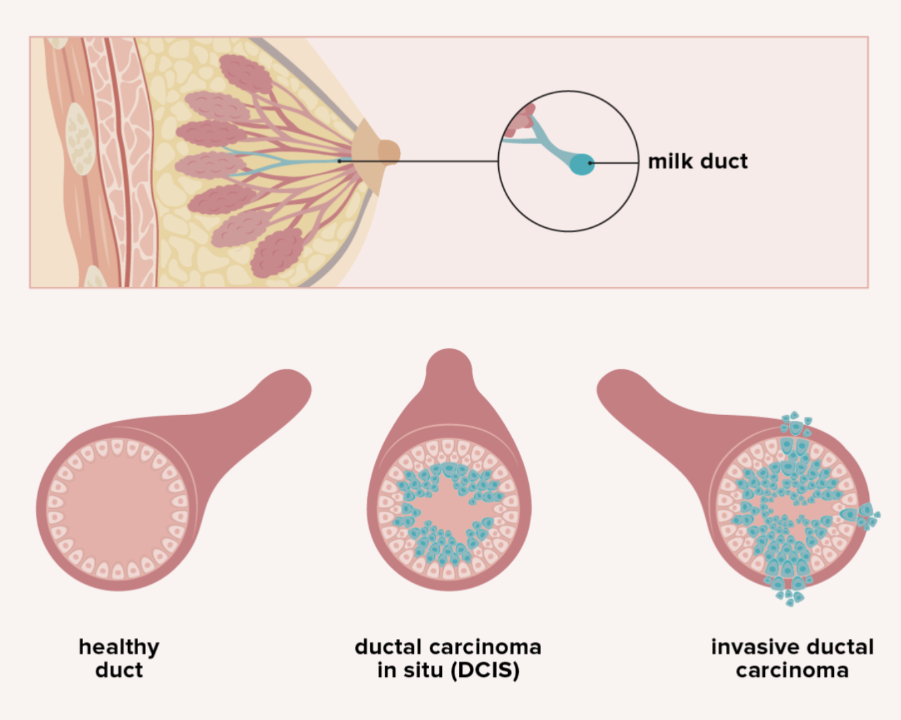

# Le carcinome canalaire infiltrant

Le cancer est l'une des principales causes de décès dans le monde, et le cancer du sein était le type de cancer le plus courant diagnostiqué chez l'Homme en 2020, même s'il est prédominant chez les femmes. Plus d'un demi-million de femmes meurent du cancer du sein chaque année dans le monde, et il est la principale cause de décès liés au cancer chez les femmes depuis 2018. 

Bien que le cancer du sein puisse être fatal, lorsqu'il ne l'est pas, il entraîne diverses complications telles que la propagation du cancer à d'autres organes ou des mastectomies (ablation des seins). La forme la plus courante de cancer du sein est le carcinome canalaire infiltrant (CCI et IDC en anglais). 

La détection précoce de ce type de cancer et le démarrage rapide du traitement améliorent significativement le pronostic des patients. Par conséquent, améliorer les méthodes de détection assistée par ordinateur est important pour minimiser les symptômes des patients.



Des chercheurs de l'université d'Edwardsville dans le sud de l'Illinois se sont déja penché sur le sujet. Ils ont également fait usage du deep learning pour aborder cette problématique et ont obtenu une précision (accuracy) de 85% (https://www.siue.edu/~dashimk/research/breast-cancer-final-report2.pdf)

# Dataset

Le dataset que nous utilisons pour la détection du cancer du sein est composé initialement de 198 738 échantillons IDC négatifs et 78 786 échantillons IDC positifs. Pour garantir une équité dans la représentation des deux classes, nous avons créé un dataset équilibré comprenant 78 786 échantillons IDC négatifs et 78 786 échantillons IDC positifs. 

Chaque image du dataset est formatée en 50x50 pixels

Le dataset a été divisé en trois ensembles distincts

- **Ensemble d'entraînement :** 80% du dataset, réservé à l'entrainement du modèle

- **Ensemble de validation :** 10% du dataset, destiné à l'ajustement des paramètres du modèle

- **Ensemble de test :** 10% du dataset, utilisé pour évaluer l'efficacité du modèle sur des données jamais vues


# Méthode d'évaluation

Afin de mesurer et de comprendre les performances de notre modèle, les métriques choisies  sont les suivantes :

- **L’accuracy** correspond au nombre de prédictions justes sur le nombre total de prédictions.

- **Le recall**, mesure la proportion de vrais positifs parmi tous les éléments positifs réels. En d'autres termes, cela mesure combien de vrais positifs l’algorithme a été capable de détecter. C'est  une mesure importante à prendre en compte dans les situations où il est crucial de ne pas manquer de détecter des éléments positifs. 

- **La précision**, quant à elle, mesure la proportion de vrais positifs parmi tous les éléments  que l’algorithme a classifiés comme positifs. En d'autres termes, cela mesure la fiabilité de  l’algorithme lorsqu'il détecte des éléments positifs. C'est une mesure importante à prendre en  compte dans les situations où il est crucial de ne pas se tromper lors de la détection de positifs. 

- **Le f1-score** est une métrique qui prend en compte à la fois la precision et le recall dans son calcul. De ce fait, il sert d’indicateur de performance globale. Il permet de tenir compte à la fois  de la capacité de l’algorithme à détecter tous les éléments positifs et de la fiabilité de ses détections  de positifs. 

Il est important de comprendre ici que le recall et la precision sont davantage utilisées comme des  métriques servant à la compréhension des points forts et points faibles du modèle plutôt que des mesures de performance. 

# Notre travail

Pour l'élaboration de notre modèle, nous avons initié la démarche avec une architecture relativement simple, puis progressivement intensifié sa complexité jusqu'à obtenir des résultats satisfaisants, avec une précision dépassant les 80%.

Cette approche itérative a conduit à la création du modèle de base suivant.

```
Model: "model"
_________________________________________________________________
 Layer (type)                Output Shape              Param #   
=================================================================
 input_1 (InputLayer)        [(None, 50, 50, 3)]       0         
                                                                 
 rescaling (Rescaling)       (None, 50, 50, 3)         0         
                                                                 
 conv2d (Conv2D)             (None, 48, 48, 32)        896       
                                                                 
 max_pooling2d (MaxPooling2D  (None, 24, 24, 32)       0         
 )                                                               
                                                                 
 conv2d_1 (Conv2D)           (None, 22, 22, 64)        18496     
                                                                 
 max_pooling2d_1 (MaxPooling  (None, 11, 11, 64)       0         
 2D)                                                             
                                                                 
 conv2d_2 (Conv2D)           (None, 9, 9, 128)         73856     
                                                                 
 max_pooling2d_2 (MaxPooling  (None, 4, 4, 128)        0         
 2D)                                                             
                                                                 
 flatten (Flatten)           (None, 2048)              0         
                                                                 
 dense (Dense)               (None, 128)               262272    
                                                                 
 dropout (Dropout)           (None, 128)               0         
                                                                 
 dense_1 (Dense)             (None, 1)                 129       
                                                                 
=================================================================
Total params: 355,649
Trainable params: 355,649
Non-trainable params: 0
_________________________________________________________________
```

**Hyper paramètres**
- batch size : 512
- optimiseur : Adam
- fonction perte : BinaryCrossentropy
- learning rate : Géré par l'optimiseur
- cnn kernel size : (3, 3)
- cnn pool size : (2, 2)
- dropout rate : 0.5
- epochs : 50

**Performances**

|            |precision         |recall            |f1-score          |
|------------|------------------|------------------|------------------|
|idc         |0.8662016487000634|0.8668612768117782|0.8665313372240548|
|non_idc     |0.86675981201575  |0.8660997588526462|0.8664296597257491|
|accuracy    |0.8664805178322122|0.8664805178322122|0.8664805178322122|


## Tentatives d'améliorations

### 1 - augmentation de la complexité du modèle

L'objectif était d'accroître la complexité du modèle en utilisant une architecture plus sophistiqué. Cela nous a conduit à l'architecture suivante.

```
Model: "model"
_________________________________________________________________
 Layer (type)                Output Shape              Param #   
=================================================================
 input_1 (InputLayer)        [(None, 50, 50, 3)]       0         
                                                                 
 rescaling (Rescaling)       (None, 50, 50, 3)         0         
                                                                 
 conv2d (Conv2D)             (None, 50, 50, 32)        896       
                                                                 
 batch_normalization (BatchN  (None, 50, 50, 32)       128       
 ormalization)                                                   
                                                                 
 conv2d_1 (Conv2D)           (None, 50, 50, 32)        9248      
                                                                 
 max_pooling2d (MaxPooling2D  (None, 25, 25, 32)       0         
 )                                                               
                                                                 
 batch_normalization_1 (Batc  (None, 25, 25, 32)       128       
 hNormalization)                                                 
                                                                 
 dropout (Dropout)           (None, 25, 25, 32)        0         
                                                                 
 conv2d_2 (Conv2D)           (None, 25, 25, 64)        18496     
                                                                 
 batch_normalization_2 (Batc  (None, 25, 25, 64)       256       
 hNormalization)                                                 
                                                                 
 conv2d_3 (Conv2D)           (None, 25, 25, 64)        36928     
                                                                 
 batch_normalization_3 (Batc  (None, 25, 25, 64)       256       
 hNormalization)                                                 
                                                                 
 max_pooling2d_1 (MaxPooling  (None, 12, 12, 64)       0         
 2D)                                                             
                                                                 
 dropout_1 (Dropout)         (None, 12, 12, 64)        0         
                                                                 
 conv2d_4 (Conv2D)           (None, 12, 12, 128)       73856     
                                                                 
 flatten (Flatten)           (None, 18432)             0         
                                                                 
 dense (Dense)               (None, 128)               2359424   
                                                                 
 batch_normalization_4 (Batc  (None, 128)              512       
 hNormalization)                                                 
                                                                 
 dense_1 (Dense)             (None, 64)                8256      
                                                                 
 batch_normalization_5 (Batc  (None, 64)               256       
 hNormalization)                                                 
                                                                 
 dense_2 (Dense)             (None, 64)                4160      
                                                                 
 dropout_2 (Dropout)         (None, 64)                0         
                                                                 
 dense_3 (Dense)             (None, 1)                 65        
                                                                 
=================================================================
Total params: 2,512,865
Trainable params: 2,512,097
Non-trainable params: 768
_________________________________________________________________
```

Cependant, cette approche s'est avérée infructueuse. Le modèle a rencontré des difficultés, notamment une incapacité à généraliser correctement, conduisant à de l'overfitting.

**Performances**

|          |precision         |recall            |f1-score          |
|----------|------------------|------------------|------------------|
| idc      |0.8380586256607401|0.8853915471506536|0.8610751095476146|
| non_idc  |0.8785310734463276|0.82891229851504  |0.8530007183438909|
| accuracy |0.8571519228328468|0.8571519228328468|0.8571519228328468|


### 2 - data augmentation


La deuxième approche a consisté à explorer les avantages de la data augmentation. Cependant, cette stratégie n'a pas non plus rencontré le succès escompté. N'apportant aucun changement significatif de l'accuracy et a même entraîné une augmentation du temps d'entraînement, car les nouvelles données étaient générées à la volée.


### 3 - hyper paramètres tuning

Pour notre troisième tentative d'amélioration, nous nous sommes concentrés sur l'optimisation des hyperparamètres à l'aide de KerasTuner. Malheureusement, cela n'a pas conduit à une amélioration significative, l'accuracy ne dépassant pas 86%.

```
Search space

{'class_name': 'Int', 'config': {'name': 'filters1', 'default': None, 'conditions': [], 'min_value': 32, 'max_value': 256, 'step': 32, 'sampling': 'linear'}}
{'class_name': 'Choice', 'config': {'name': 'kernel_size1', 'default': 3, 'conditions': [], 'values': [3, 5], 'ordered': True}}
{'class_name': 'Int', 'config': {'name': 'filters2', 'default': None, 'conditions': [], 'min_value': 32, 'max_value': 256, 'step': 32, 'sampling': 'linear'}}
{'class_name': 'Choice', 'config': {'name': 'kernel_size2', 'default': 3, 'conditions': [], 'values': [3, 5], 'ordered': True}}
{'class_name': 'Int', 'config': {'name': 'filters3', 'default': None, 'conditions': [], 'min_value': 32, 'max_value': 256, 'step': 32, 'sampling': 'linear'}}
{'class_name': 'Choice', 'config': {'name': 'kernel_size3', 'default': 3, 'conditions': [], 'values': [3, 5], 'ordered': True}}
{'class_name': 'Int', 'config': {'name': 'units', 'default': None, 'conditions': [], 'min_value': 32, 'max_value': 256, 'step': 32, 'sampling': 'linear'}}
{'class_name': 'Float', 'config': {'name': 'lr', 'default': 0.0001, 'conditions': [], 'min_value': 0.0001, 'max_value': 0.01, 'step': None, 'sampling': 'log'}}
```

|modèle      | accuracy           |
|------------|--------------------|
|trial_09    | 0.8558192849159241 |
|trial_07    | 0.8524559140205383 |
|trial_00    | 0.8518847823143005 |
|trial_01    | 0.86102294921875   |
|trial_06    | 0.8559461832046509 |
|trial_08    | 0.8492829203605652 |
|trial_03    | 0.8507424592971802 |
|trial_04    | 0.8565173149108887 |
|trial_05    | 0.8549942970275879 |
|trial_02    | 0.5                |

### 4 - transfert learning

Enfin, nous avons essayé le transfert learning avec VGG16. Mais cela n'a non plus pas été concluant, car l'accuracy n'a pas dépassé les 80%. De plus, en terme de taille, le modèle était beaucoup plus lourd que le modèle de base.

```
Model: "model"
_________________________________________________________________
 Layer (type)                Output Shape              Param #   
=================================================================
 input_1 (InputLayer)        [(None, 50, 50, 3)]       0         
                                                                 
 block1_conv1 (Conv2D)       (None, 50, 50, 64)        1792      
                                                                 
 block1_conv2 (Conv2D)       (None, 50, 50, 64)        36928     
                                                                 
 block1_pool (MaxPooling2D)  (None, 25, 25, 64)        0         
                                                                 
 block2_conv1 (Conv2D)       (None, 25, 25, 128)       73856     
                                                                 
 block2_conv2 (Conv2D)       (None, 25, 25, 128)       147584    
                                                                 
 block2_pool (MaxPooling2D)  (None, 12, 12, 128)       0         
                                                                 
 block3_conv1 (Conv2D)       (None, 12, 12, 256)       295168    
                                                                 
 block3_conv2 (Conv2D)       (None, 12, 12, 256)       590080    
                                                                 
 block3_conv3 (Conv2D)       (None, 12, 12, 256)       590080    
                                                                 
 block3_pool (MaxPooling2D)  (None, 6, 6, 256)         0         
                                                                 
 block4_conv1 (Conv2D)       (None, 6, 6, 512)         1180160   
                                                                 
 block4_conv2 (Conv2D)       (None, 6, 6, 512)         2359808   
                                                                 
 block4_conv3 (Conv2D)       (None, 6, 6, 512)         2359808   
                                                                 
 block4_pool (MaxPooling2D)  (None, 3, 3, 512)         0         
                                                                 
 block5_conv1 (Conv2D)       (None, 3, 3, 512)         2359808   
                                                                 
 block5_conv2 (Conv2D)       (None, 3, 3, 512)         2359808   
                                                                 
 block5_conv3 (Conv2D)       (None, 3, 3, 512)         2359808   
                                                                 
 block5_pool (MaxPooling2D)  (None, 1, 1, 512)         0         
                                                                 
 global_average_pooling2d (G  (None, 512)              0         
 lobalAveragePooling2D)                                          
                                                                 
 dropout (Dropout)           (None, 512)               0         
                                                                 
 dense (Dense)               (None, 4096)              2101248   
                                                                 
 dense_1 (Dense)             (None, 4096)              16781312  
                                                                 
 dropout_1 (Dropout)         (None, 4096)              0         
                                                                 
 dense_2 (Dense)             (None, 2096)              8587312   
                                                                 
 dense_3 (Dense)             (None, 1)                 2097      
                                                                 
=================================================================
Total params: 42,186,657
Trainable params: 27,471,969
Non-trainable params: 14,714,688
_________________________________________________________________
```

**Hyper paramètres**
- batch size : 256
- optimiseur : Adam
- fonction perte : BinaryCrossentropy
- learning rate : 0.0001
- dropout rate : 0.2
- epochs : 30

**Performances**

|          |precision         |recall            |f1-score          |
|----------|------------------|------------------|------------------|
| idc      |0.7949728930507639|0.8188856453864704|0.8067521100343856|
| non_idc  |0.8132687778068568|0.7888056860007615|0.8008504606661941|
| accuracy |0.8038456656936159|0.8038456656936159|0.8038456656936159|


En gardant la même configuration, mais avec un learning rate de 0.001 nous avons réussis à obtenir les résultats suivants.

|          | precision          | recall             | f1-score           |
|----------|--------------------|--------------------|--------------------|
| idc      | 0.9587450442430007 | 0.9511733571439703 | 0.9598009983829376 |
| non_idc  | 0.7114007563970618 | 0.7279691367321938 | 0.7259508339147157 |
| accuracy | 0.9166937461737264 | 0.9166937461737264 | 0.9166937461737264 |

Cette configuration nous permet d'être plus précis (+ 9% f1-score pour idc) dans la détection du cancer. En contre partie, le modèle est beaucoup moins précis dans la détection des personnes non-malades (- 14% f1-score pour non-idc). Or, lors de cet exercice de classification, il est impératif de porter une attention particulière aux faux négatifs et aux faux positifs. En effet, nous devons éviter de manquer des cas réellement malades tout en nous assurant de ne pas diagnostiquer à tort des personnes en bonne santé. Le risque de classer incorrectement quelqu'un comme "positif au cancer" et de le soumettre à des traitements douloureux et coûteux, alors qu'ils ne sont pas nécessaires, est une préoccupation majeure. 

Par conséquent, nous n'avons pas conservé ce modèle. Nous avons préféré conserver le modèle de base, qui présentait un f1-score de 86% pour les deux classes car ont considère qu'il est plus adapté à notre problème.

# Conclusion

Paradoxallement, le modèle le plus simple est celui qui a donné les meilleurs résultats même si nous n'avons pas explorer toutes les améliorations possibles. Ce travail nous a permis de comprendre que la complexité d'un modèle n'est pas toujours synonyme de performance.

Ce mini-projet fut très enrichissant. Il nous a permis de mettre en pratique les connaissances acquises lors de ce cours. Nous avons pu expérimenter différentes approches et comprendre les avantages et les inconvénients de chacune d'entre elles.